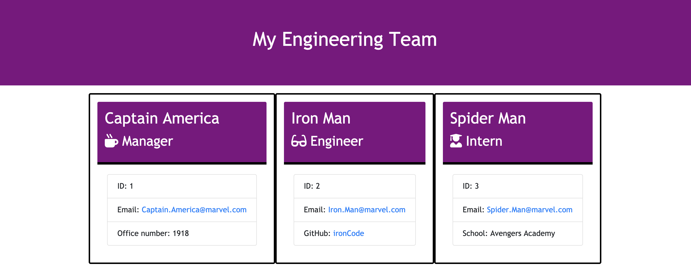

# teamProfileGenerator
GW Coding Bootcamp Homework #10




## Description
This appplication is a software engineering team generator command line application. The application will prompt the user for information about the team members including the manager, engineer, and intern. The user can input any number of team members. Since testing is a key piece in making code maintainable, this app will also be ensuring that all unit tests pass. When the user has completed building the team, the application will create an HTML file that displays a nicely formatted team roster based on the information provided by the user.


## Mock-Up


## NPM Modules
* Inquirer
* Colors


## Set Up
Download the dependencies by using the following command in the terminal: 
```bash
npm i
```

The application can be invoked by using the following command in the terminal: 
```bash
node app.js
```


## Walkthrough Video
This [walkthrough video](https://drive.google.com/file/d/1qsQOGFalrKjp5x2Pg1IrJyfPOiU_KFnK/view) will demonstrate the application functionality. 


